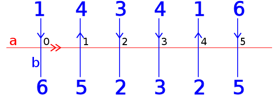

Metric in the Curve Complex: MICC
=================================
.. image:: https://travis-ci.org/MICC/MICC.svg?branch=master
    :target: https://travis-ci.org/MICC/MICC

The curve complex is a simplicial complex composed of vertices representing equivalency classes of isotopic 
simple closed curves on a surface of fixed genus and of edges drawn between vertices if classes contain a disjoint 
representative. MICC is a tool designed to compute short distances between these disjoint representatives, based 
on an intuitive disk-with-handles represntation of a surface.

Installation
------------
Installing through pip is recommended to use the programmatic interface:
::

    $ pip install micc

Otherwise, the command line interface for MICC is available `here <http://micc.github.io/>`_.

Getting Started
---------------
Example useage of MICC:

.. code-block:: python

    from micc.curvepair import CurvePair

    top    = [21,7,8,9,10,11,22,23,24,0,1,2,3,4,5,6,12,13,14,15,16,17,18,19,20]
    bottom = [9,10,11,12,13,14,15,1,2,3,4,5,16,17,18,19,20,21,22,23,24,0,6,7,8]
    test = CurvePair(top, bottom)
    print test.distance

Documentation
-------------

MICC's key interface is an abstract representation of a pair of curves *a*,*b* on a surace *S* of genus *g*.
We present the details and nuances in our full publication <link>.

Define one of the two curves as a reference curve; in the above case, we choose *a* as our reference curve.
Aftering arbitrarily labeling  the arcs of *b* created by the removal of *a*, as shown above, read off the 
chosen identifications in the order they appear on the each side of *a* during an oriented traversal. Upon 
doing so, you will have two sequences of integer identifications. In the above example, they look like:

.. code-block:: python

    [1, 4, 3, 4, 1, 6]
    [6, 5, 2, 3, 2, 5]
    
These two lists are the input to the CurvePair object, the primary interface layer for MICC. It is highly recommended 
that users restrict their attention to this object alone.

To compute the distance between *a* and *b*:

.. code-block:: python
    
    >>> curve = CurvePair([1, 4, 3, 4, 1, 6],[6, 5, 2, 3, 2, 5])
    >>> curve.distance
    3
    
TODO

License
-------
Copyright 2014 Matt Morse and Paul Glenn.

MICC is licensed under the `MIT License <https://github.com/MICC/MICC/blob/master/LICENSE>`_.
